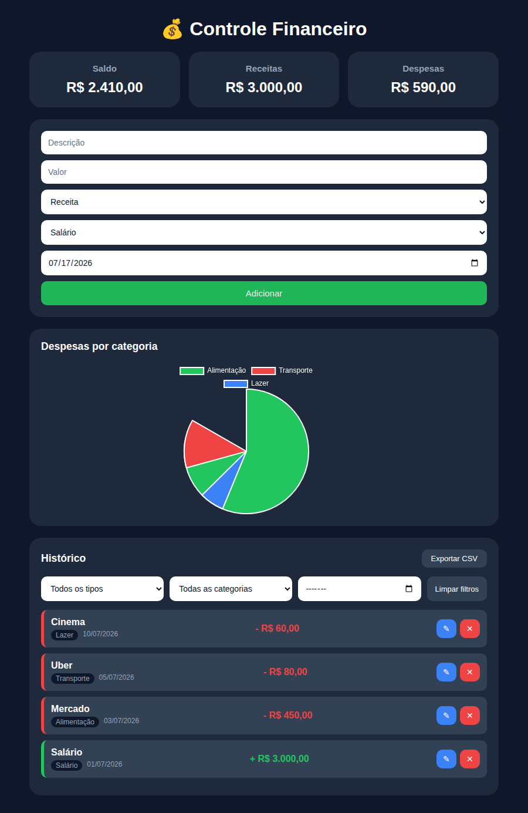

# 💰 Controle Financeiro

Aplicação web para controle de receitas e despesas pessoais, feita em **HTML, CSS e JavaScript puro**, com persistência de dados no navegador via `localStorage`. Hospedada no GitHub Pages.

🔗 **Demo ao vivo:** [znunesz.github.io/controle-financeiro](https://znunesz.github.io/controle-financeiro/)

## Funcionalidades

- **Resumo em tempo real** de saldo, receitas e despesas, com valores formatados em Real (`Intl.NumberFormat`)
- **Cadastro de transações** com descrição, valor, tipo, **categoria** e **data**
- **Edição** de transações já lançadas (não é mais preciso excluir para corrigir um valor)
- **Exclusão com confirmação**, evitando apagar algo sem querer
- **Filtros** por tipo, categoria e mês
- **Gráfico de pizza** (Chart.js) mostrando a distribuição de despesas por categoria
- **Exportação para CSV** do histórico completo
- **Persistência local**: os dados ficam salvos no `localStorage` do navegador, então continuam lá mesmo se a página for fechada e reaberta

## Stack

- **HTML5** — estrutura da página
- **CSS3** — layout em grid, tema escuro, sem framework de UI
- **JavaScript (vanilla)** — lógica de cálculo, filtros, edição e persistência de dados
- **Chart.js** — gráfico de despesas por categoria
- **Web Storage API (`localStorage`)** — guarda as transações no navegador, sem precisar de backend ou banco de dados

## Como funciona

Cada transação é um objeto `{ id, descricao, valor, tipo, categoria, data }` guardado num array em memória. A cada alteração (adicionar, editar ou remover), o array é:

1. Recalculado para atualizar os cards de saldo, receitas e despesas
2. Filtrado conforme os filtros ativos (tipo, categoria, mês) e re-renderizado no histórico
3. Usado para atualizar o gráfico de despesas por categoria
4. Salvo no `localStorage`, convertido para JSON, garantindo que os dados sobrevivam ao fechar a aba

## Rodando localmente

Site 100% estático — basta abrir o `index.html` no navegador, não precisa de servidor nem instalação de dependências.

## Possíveis melhorias futuras

- Migrar do `localStorage` para um backend real (Firebase ou Supabase), permitindo acessar os dados de qualquer dispositivo
- Autenticação de usuário, pra suportar mais de uma pessoa usando o mesmo app
- Metas de gastos por categoria com alerta ao ultrapassar o limite

## Autor

Desenvolvido por [znunesz](https://github.com/znunesz).
